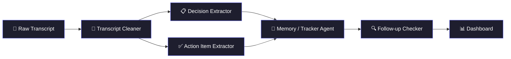

<div align="center">


### 🧠 A multi-agent system that turns raw meeting transcripts into structured, trackable action items


</div>

---

## 📌 About

Most transcription tools (Otter.ai, Fireflies) stop at giving you a transcript.

**Recap AI's** core idea is **cross-session memory** — it remembers action items from past meetings and automatically checks whether they were completed when a new, related transcript is uploaded.

> ⚠️ **This is a prototype**, built to explore multi-agent orchestration, real-time communication, and cross-session state persistence — not a polished production product (yet).

---

## 🔗 Pipeline Overview



## 🤖 The Five Agents

| Agent | Role |
|---|---|
| 📝 **Transcript Cleaner** | Normalizes the raw transcript and identifies speakers |
| 📋 **Decision Extractor** | Pulls out key decisions made during the meeting |
| ✅ **Action Item Extractor** | Identifies who was assigned what, and any deadlines |
| 💾 **Memory / Tracker Agent** | Saves new action items as pending |
| 🔍 **Follow-up Checker** | Compares a new transcript against previously pending items and updates status to `done`, `still pending`, or `overdue` |

Splitting the work across focused agents (instead of one big LLM call) makes the output more reliable, and each part is independently testable and improvable.

---

## ⚡ Real-Time Agent Progress

Instead of a plain loading spinner, the backend streams **live updates over WebSocket** — so as each agent starts and finishes its work, the frontend shows exactly what's happening in real time.

```
📝 Transcript Cleaner   ████████████████████ done
📋 Decision Extractor   ████████████████████ done
✅ Action Item Extractor ███████████░░░░░░░░ running...
💾 Memory/Tracker Agent  ░░░░░░░░░░░░░░░░░░░░ waiting
🔍 Follow-up Checker     ░░░░░░░░░░░░░░░░░░░░ waiting
```

---

## 🛠️ Tech Stack

<div align="center">

### Frontend


### Backend


### AI Stack


### Storage


</div>

---

## 🧩 Why Multiple Agents Instead of One LLM Call

A single prompt asked to "analyze and track everything" tends to produce shallow, unstructured output.

Splitting responsibility across narrow, well-defined agents produces:
- ✅ More reliable output
- 🧪 Independently testable components
- 🔧 Independently improvable pipeline stages
- ➕ Easy extension (new agents can be added without touching the rest)

---

## 🚀 Status

This is still a **prototype** — built to explore multi-agent orchestration, real-time communication over WebSocket, and state persistence across sessions, rather than just another single-prompt demo.

---

<div align="center">

### 💬 Feedback & discussion welcome

If you're working on similar problems — multi-agent pipelines, cross-session memory, or real-time agent streaming — feel free to open an issue or start a discussion.


</div>
